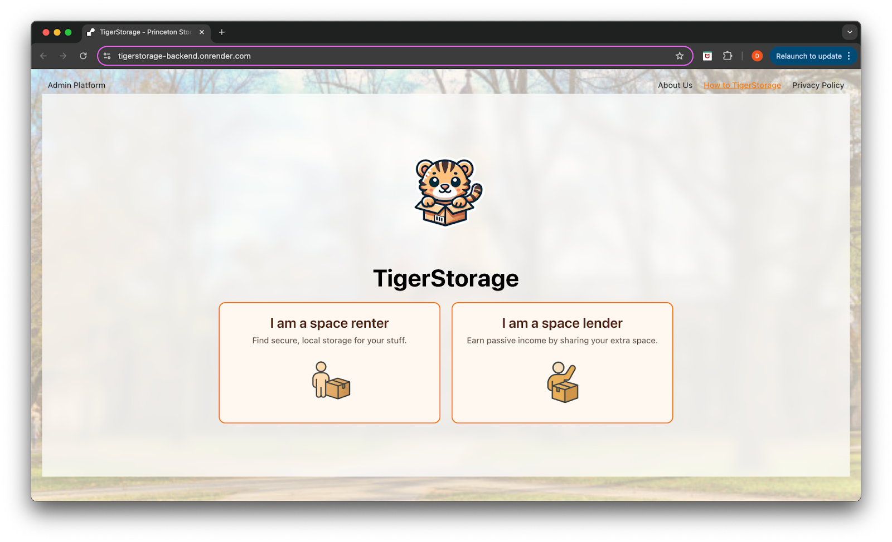
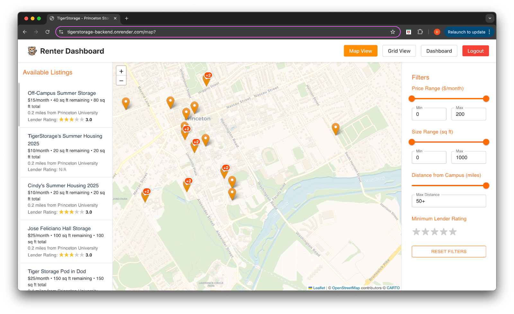
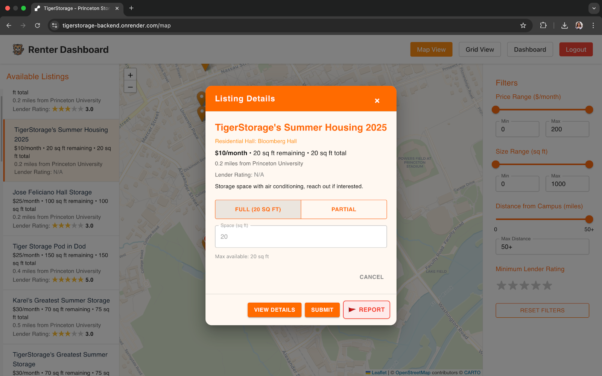
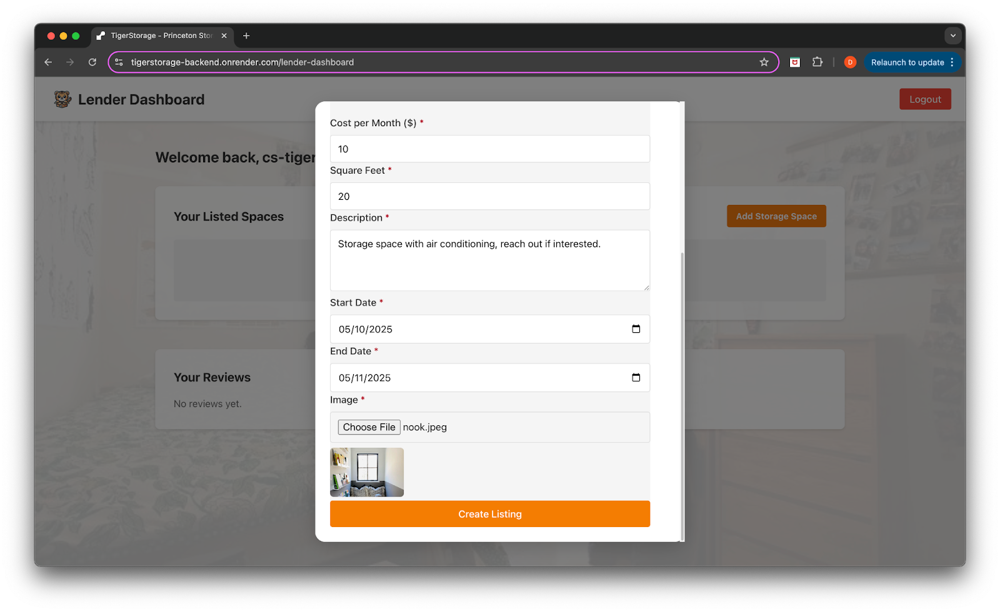
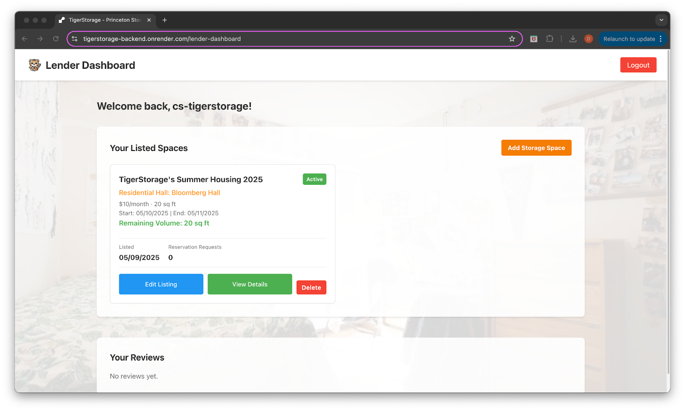
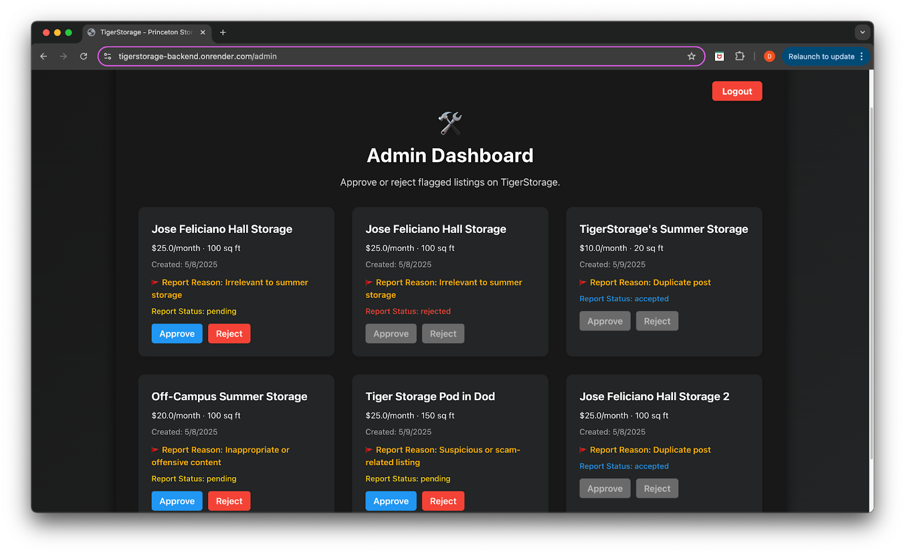
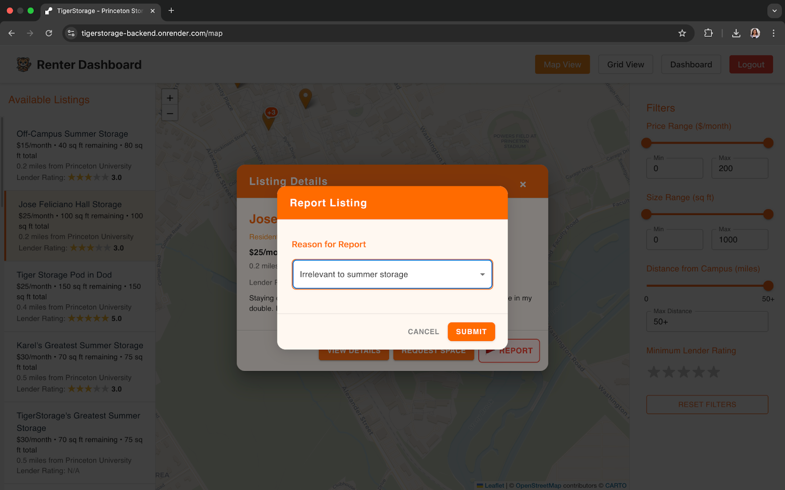

# TigerStorage

TigerStorage is a full-stack storage rental platform for Princeton University students. With secure CAS authentication, students can easily rent or offer storage space during transitional periods such as summer break or study abroad. It provides tailored dashboards for both **renters** and **lenders**, with intuitive listing management and seamless user experience.

---

## Tech Stack

| Layer       | Technology      |
|-------------|-----------------|
| Frontend    | React + Vite     |
| Backend     | Flask (Python)   |
| Database    | PostgreSQL       |
| Auth        | Princeton CAS    |
| Deployment  | Render           |


---

## Database Schema

 

---

## Live Demo

- **Link**: [https://tigerstorage-frontend.onrender.com](https://tigerstorage-frontend.onrender.com)
- ***Note: The live demo link is currently down.***

---

## User Interface Previews
Landing page
 
Renter dashboard 
- Map view
 
 
 
- Grid view
 
 

Lender dashboard
 
- Create a listing 
 
 
- View details of a listing
 
- Approving a renter request
 
Admin platform
 
Additional features

- Ratings for lenders
 
- Flagging listings
 

### Testing
There is no formal test suite at this time. To manually test:
- Use Postman or curl to check API routes
- Use React Developer Tools to verify frontend state
- Simulate login or mock session data locally

### Roadmap / Future Enhancements
- Testing with Pytest + React Testing Library
- Image uploads for storage listings
- Payment integration (Stripe, PayPal)
- User profiles and preferences
- Admin dashboard
- Responsive mobile design
- Chatbot integration for support
 

### FAQ
Q: Can anyone use this platform?
A: No — authentication is restricted to Princeton University users via CAS.

Q: Why can't the frontend access the backend?
A: Make sure your .env file includes a valid VITE_API_URL, and CORS is configured in Flask.

Q: How do I reset the database?

```bash
psql "your-connection-string" -f backend/database.sql
```

### Contributors
- Diya Hundiwala (Computer Science Princeton '27)
- Shirley Yu (Computer Science Princeton '27)
- Cindy Tong (Computer Science Princeton '27)